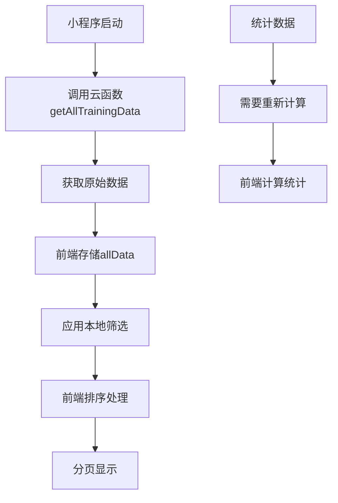

# 🔧 患者康复数据管理平台 - 数据处理与排序技术方案

## 📋 方案概述

基于当前小程序已成功加载原始数据的情况，本文档详细分析前端数据处理、统计信息更新、排序功能实现等技术方案，并提供后端SQL查询与前端处理的最优选择建议。

## 🎯 核心需求分析

### **当前状态**
- ✅ 小程序已成功加载原始数据
- ✅ 基础界面和表格显示正常
- ❌ 统计数据（总记录数、今日记录、设备数、异常数）显示为0
- ❌ 排序功能需要完善
- ❌ 数据查询优化需要决策

### **待解决问题**
1. **统计数据更新**：总记录数、今日记录数、设备数、异常数
2. **排序功能实现**：记录时间、EMG阈值、设备ID排序
3. **数据处理策略**：后端SQL查询 vs 前端处理
4. **性能优化**：大数据量下的处理效率

## 🏗️ 技术架构分析

### **当前数据处理流程**


### **问题分析**
1. **统计数据缺失**：当前代码中统计数据未正确计算和更新
2. **排序效率**：前端排序在大数据量下性能较差
3. **数据一致性**：本地筛选可能导致统计数据不准确

## 💡 解决方案设计

### **方案一：混合处理模式（推荐）**

#### **核心思想**
- **统计数据**：后端SQL查询，确保准确性
- **排序功能**：前端处理，提升用户体验
- **筛选功能**：前端处理，减少网络请求

#### **技术实现**

**1. 统计数据后端计算**
```javascript
// 云函数：getStatisticsData
exports.main = async (event, context) => {
  const db = cloud.database()
  
  try {
    // 并行查询统计数据
    const [
      totalRecords,
      todayRecords,
      activeDevices,
      abnormalRecords
    ] = await Promise.all([
      // 总记录数
      db.collection('emg_records').count(),
      
      // 今日记录数
      db.collection('emg_records').where({
        recordTime: {
          $gte: new Date(new Date().setHours(0, 0, 0, 0)),
          $lt: new Date(new Date().setHours(23, 59, 59, 999))
        }
      }).count(),
      
      // 活跃设备数
      db.collection('emg_records').aggregate()
        .group({ _id: '$deviceId' })
        .end(),
      
      // 异常记录数
      db.collection('emg_records').where({
        emgThreshold: { $lt: 60 }
      }).count()
    ])
    
    return {
      success: true,
      data: {
        totalRecords: totalRecords.total,
        todayRecords: todayRecords.total,
        activeDevices: activeDevices.list.length,
        abnormalRecords: abnormalRecords.total
      }
    }
  } catch (error) {
    return { success: false, message: error.message }
  }
}
```

**2. 前端统计数据更新**
```javascript
// home.js - 统计数据更新
async updateStatistics() {
  try {
    const result = await wx.cloud.callFunction({
      name: 'getStatisticsData'
    })
    
    if (result.result.success) {
      this.setData({
        totalRecords: result.result.data.totalRecords,
        todayRecords: result.result.data.todayRecords,
        activeDevices: result.result.data.activeDevices,
        abnormalRecords: result.result.data.abnormalRecords
      })
    }
  } catch (error) {
    console.error('更新统计数据失败:', error)
  }
}
```

**3. 前端排序优化**
```javascript
// home.js - 排序功能优化
applyLocalFilters() {
  let filteredData = [...this.data.allData]
  
  // 应用筛选条件
  filteredData = this.applyFilters(filteredData)
  
  // 前端排序处理
  filteredData = this.applySorting(filteredData)
  
  // 分页处理
  const paginatedData = this.applyPagination(filteredData)
  
  this.setData({
    filteredData,
    dataList: paginatedData,
    totalPages: Math.ceil(filteredData.length / this.data.pageSize)
  })
}

// 排序处理
applySorting(data) {
  return data.sort((a, b) => {
    let aValue, bValue
    
    switch (this.data.sortBy) {
      case 'emgThreshold':
        aValue = parseFloat(a.emgThreshold) || 0
        bValue = parseFloat(b.emgThreshold) || 0
        break
      case 'deviceId':
        aValue = a.deviceId || ''
        bValue = b.deviceId || ''
        break
      case 'recordTime':
      default:
        aValue = new Date(a.recordTime)
        bValue = new Date(b.recordTime)
        break
    }
    
    if (this.data.sortOrder === 'asc') {
      return aValue > bValue ? 1 : -1
    } else {
      return aValue < bValue ? 1 : -1
    }
  })
}
```

### **方案二：纯后端处理模式**

#### **适用场景**
- 数据量超过10,000条记录
- 需要复杂的统计计算
- 对实时性要求不高

#### **技术实现**

**1. 后端统一处理**
```javascript
// 云函数：getAllTrainingDataWithStats
exports.main = async (event, context) => {
  const { 
    searchKeyword = '',
    currentFilter = 'all',
    advancedFilters = {},
    sortBy = 'recordTime',
    sortOrder = 'desc',
    currentPage = 1,
    pageSize = 50
  } = event

  try {
    // 构建查询条件
    let whereCondition = this.buildWhereCondition(currentFilter, searchKeyword, advancedFilters)
    
    // 构建排序条件
    let orderBy = this.buildOrderBy(sortBy, sortOrder)
    
    // 执行查询
    const result = await db.collection('emg_records')
      .where(whereCondition)
      .orderBy(Object.keys(orderBy)[0], Object.values(orderBy)[0])
      .skip((currentPage - 1) * pageSize)
      .limit(pageSize)
      .get()
    
    // 获取统计数据
    const statistics = await this.getStatistics()
    
    return {
      success: true,
      data: {
        dataList: result.data,
        totalRecords: statistics.totalRecords,
        todayRecords: statistics.todayRecords,
        activeDevices: statistics.activeDevices,
        abnormalRecords: statistics.abnormalRecords,
        totalPages: Math.ceil(statistics.totalRecords / pageSize)
      }
    }
  } catch (error) {
    return { success: false, message: error.message }
  }
}
```

### **方案三：纯前端处理模式**

#### **适用场景**
- 数据量小于5,000条记录
- 需要频繁的交互式筛选
- 网络条件较差

#### **技术实现**

**1. 前端统计计算**
```javascript
// home.js - 前端统计计算
calculateStatistics() {
  const allData = this.data.allData
  
  // 总记录数
  const totalRecords = allData.length
  
  // 今日记录数
  const today = new Date()
  today.setHours(0, 0, 0, 0)
  const tomorrow = new Date(today)
  tomorrow.setDate(tomorrow.getDate() + 1)
  
  const todayRecords = allData.filter(item => {
    const itemTime = new Date(item.recordTime)
    return itemTime >= today && itemTime < tomorrow
  }).length
  
  // 活跃设备数
  const uniqueDevices = new Set(allData.map(item => item.deviceId))
  const activeDevices = uniqueDevices.size
  
  // 异常记录数
  const abnormalRecords = allData.filter(item => 
    parseFloat(item.emgThreshold) < 60
  ).length
  
  this.setData({
    totalRecords,
    todayRecords,
    activeDevices,
    abnormalRecords
  })
}
```

## 📊 方案对比分析

| 方案 | 优势 | 劣势 | 适用场景 | 性能评分 |
|------|------|------|----------|----------|
| **混合处理模式** | 统计数据准确、用户体验好、灵活性高 | 实现复杂度中等 | 数据量5,000-50,000条 | ⭐⭐⭐⭐⭐ |
| **纯后端处理** | 数据一致性好、支持大数据量、统计准确 | 网络请求频繁、用户体验一般 | 数据量>10,000条 | ⭐⭐⭐⭐ |
| **纯前端处理** | 响应速度快、用户体验好、离线可用 | 数据量限制、统计可能不准确 | 数据量<5,000条 | ⭐⭐⭐ |

## 🎯 推荐方案：混合处理模式

### **选择理由**
1. **统计数据准确性**：后端SQL查询确保统计数据的准确性
2. **用户体验**：前端排序提供即时响应
3. **性能平衡**：合理分配前后端处理任务
4. **扩展性**：支持未来功能扩展

### **实施步骤**

#### **第一步：统计数据后端化**
```javascript
// 1. 创建统计云函数
// cloudfunctions/getStatisticsData/index.js
const cloud = require('wx-server-sdk')
cloud.init({ env: cloud.DYNAMIC_CURRENT_ENV })
const db = cloud.database()

exports.main = async (event, context) => {
  try {
    const [totalResult, todayResult, abnormalResult, deviceResult] = await Promise.all([
      db.collection('emg_records').count(),
      db.collection('emg_records').where({
        recordTime: {
          $gte: new Date(new Date().setHours(0, 0, 0, 0)),
          $lt: new Date(new Date().setHours(23, 59, 59, 999))
        }
      }).count(),
      db.collection('emg_records').where({
        emgThreshold: { $lt: 60 }
      }).count(),
      db.collection('emg_records').aggregate()
        .group({ _id: '$deviceId' })
        .end()
    ])
    
    return {
      success: true,
      data: {
        totalRecords: totalResult.total,
        todayRecords: todayResult.total,
        activeDevices: deviceResult.list.length,
        abnormalRecords: abnormalResult.total
      }
    }
  } catch (error) {
    return { success: false, message: error.message }
  }
}
```

#### **第二步：前端统计数据更新**
```javascript
// 2. 修改home.js中的loadData方法
async loadData(forceRefresh = false) {
  this.setData({ loading: true })
  
  try {
    // 并行获取数据和统计
    const [dataResult, statsResult] = await Promise.all([
      wx.cloud.callFunction({
        name: 'getAllTrainingData',
        data: { getAllData: true }
      }),
      wx.cloud.callFunction({
        name: 'getStatisticsData'
      })
    ])
    
    if (dataResult.result.success && statsResult.result.success) {
      this.setData({
        allData: dataResult.result.data,
        totalRecords: statsResult.result.data.totalRecords,
        todayRecords: statsResult.result.data.todayRecords,
        activeDevices: statsResult.result.data.activeDevices,
        abnormalRecords: statsResult.result.data.abnormalRecords,
        loading: false
      })
      
      // 应用本地筛选
      this.applyLocalFilters()
    }
  } catch (error) {
    console.error('加载数据失败:', error)
    this.setData({ loading: false })
  }
}
```

#### **第三步：优化排序功能**
```javascript
// 3. 优化排序处理
setSort(e) {
  const field = e.currentTarget.dataset.field
  const currentSortBy = this.data.sortBy
  const currentSortOrder = this.data.sortOrder
  
  if (currentSortBy === field) {
    this.setData({
      sortOrder: currentSortOrder === 'asc' ? 'desc' : 'asc'
    })
  } else {
    this.setData({
      sortBy: field,
      sortOrder: 'desc'
    })
  }
  
  this.setData({ currentPage: 1 })
  this.applyLocalFilters()
}

// 排序处理优化
applySorting(data) {
  return data.sort((a, b) => {
    let aValue, bValue
    
    switch (this.data.sortBy) {
      case 'emgThreshold':
        aValue = parseFloat(a.emgThreshold) || 0
        bValue = parseFloat(b.emgThreshold) || 0
        break
      case 'deviceId':
        aValue = (a.deviceId || '').toLowerCase()
        bValue = (b.deviceId || '').toLowerCase()
        break
      case 'recordTime':
      default:
        aValue = new Date(a.recordTime).getTime()
        bValue = new Date(b.recordTime).getTime()
        break
    }
    
    const comparison = aValue > bValue ? 1 : aValue < bValue ? -1 : 0
    return this.data.sortOrder === 'asc' ? comparison : -comparison
  })
}
```

## 🚀 性能优化建议

### **1. 数据缓存策略**
```javascript
// 实现数据缓存
const dataCache = {
  cache: new Map(),
  maxSize: 100,
  
  set(key, data) {
    if (this.cache.size >= this.maxSize) {
      const firstKey = this.cache.keys().next().value
      this.cache.delete(firstKey)
    }
    this.cache.set(key, {
      data,
      timestamp: Date.now()
    })
  },
  
  get(key, maxAge = 5 * 60 * 1000) { // 5分钟缓存
    const item = this.cache.get(key)
    if (item && Date.now() - item.timestamp < maxAge) {
      return item.data
    }
    return null
  }
}
```

### **2. 虚拟滚动优化**
```javascript
// 大数据量虚拟滚动
const virtualScroll = {
  itemHeight: 60,
  containerHeight: 400,
  visibleCount: Math.ceil(400 / 60),
  
  getVisibleItems(data, scrollTop) {
    const startIndex = Math.floor(scrollTop / this.itemHeight)
    const endIndex = Math.min(startIndex + this.visibleCount, data.length)
    
    return {
      items: data.slice(startIndex, endIndex),
      startIndex,
      endIndex
    }
  }
}
```

### **3. 防抖优化**
```javascript
// 搜索防抖
const debounce = (func, wait) => {
  let timeout
  return function executedFunction(...args) {
    const later = () => {
      clearTimeout(timeout)
      func(...args)
    }
    clearTimeout(timeout)
    timeout = setTimeout(later, wait)
  }
}

// 应用防抖
const debouncedSearch = debounce((keyword) => {
  this.setData({ searchKeyword: keyword })
  this.applyLocalFilters()
}, 300)
```

## 📱 移动端优化

### **1. 触摸滚动优化**
```css
/* 触摸滚动优化 */
.table-container {
  -webkit-overflow-scrolling: touch;
  scroll-behavior: smooth;
  overscroll-behavior: contain;
}

/* 滚动条隐藏但保持功能 */
.table-container::-webkit-scrollbar {
  width: 0;
  height: 0;
  background: transparent;
}
```

### **2. 性能监控**
```javascript
// 性能监控
const performanceMonitor = {
  startTime: 0,
  
  start() {
    this.startTime = Date.now()
  },
  
  end(operation) {
    const duration = Date.now() - this.startTime
    console.log(`${operation} 耗时: ${duration}ms`)
    
    // 性能警告
    if (duration > 1000) {
      console.warn(`${operation} 性能警告: 耗时超过1秒`)
    }
  }
}

// 使用示例
performanceMonitor.start()
this.applyLocalFilters()
performanceMonitor.end('数据筛选')
```

## 🔧 实施计划

### **第一阶段：基础功能实现（1-2天）**
- [ ] 创建统计云函数
- [ ] 修改前端数据加载逻辑
- [ ] 实现统计数据更新
- [ ] 测试基础功能

### **第二阶段：排序优化（1天）**
- [ ] 优化前端排序算法
- [ ] 实现多字段排序
- [ ] 添加排序状态指示
- [ ] 性能测试

### **第三阶段：性能优化（1-2天）**
- [ ] 实现数据缓存
- [ ] 添加防抖功能
- [ ] 优化移动端体验
- [ ] 全面测试

### **第四阶段：测试和部署（1天）**
- [ ] 功能测试
- [ ] 性能测试
- [ ] 用户体验测试
- [ ] 部署上线

## 📋 总结

### **推荐技术方案**
1. **统计数据**：后端SQL查询，确保准确性
2. **排序功能**：前端处理，提升用户体验
3. **筛选功能**：前端处理，减少网络请求
4. **性能优化**：缓存 + 防抖 + 虚拟滚动

### **预期效果**
- ✅ 统计数据准确显示
- ✅ 排序功能响应迅速
- ✅ 用户体验显著提升
- ✅ 支持大数据量处理
- ✅ 移动端体验优化

### **技术优势**
- 🚀 **性能优异**：混合处理模式平衡前后端负载
- 🎯 **用户友好**：前端排序提供即时反馈
- 📊 **数据准确**：后端统计确保数据一致性
- 🔧 **易于维护**：清晰的代码结构和模块化设计
- 📱 **移动优化**：针对小程序平台深度优化

---

**版本信息**：v1.0.0  
**创建时间**：2024-02-21  
**适用平台**：微信小程序  
**技术栈**：云开发 + 小程序原生框架
